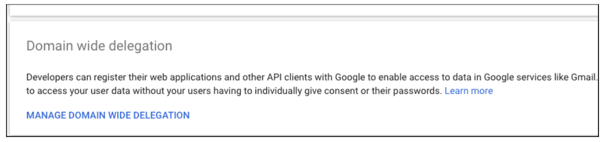
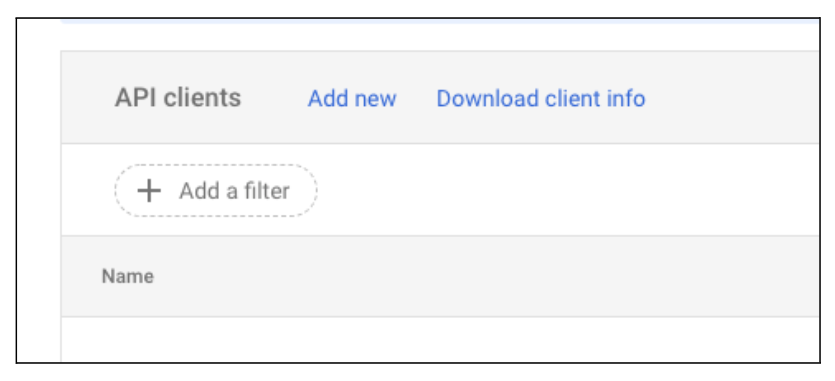
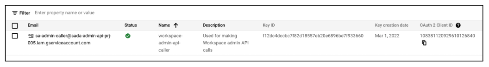
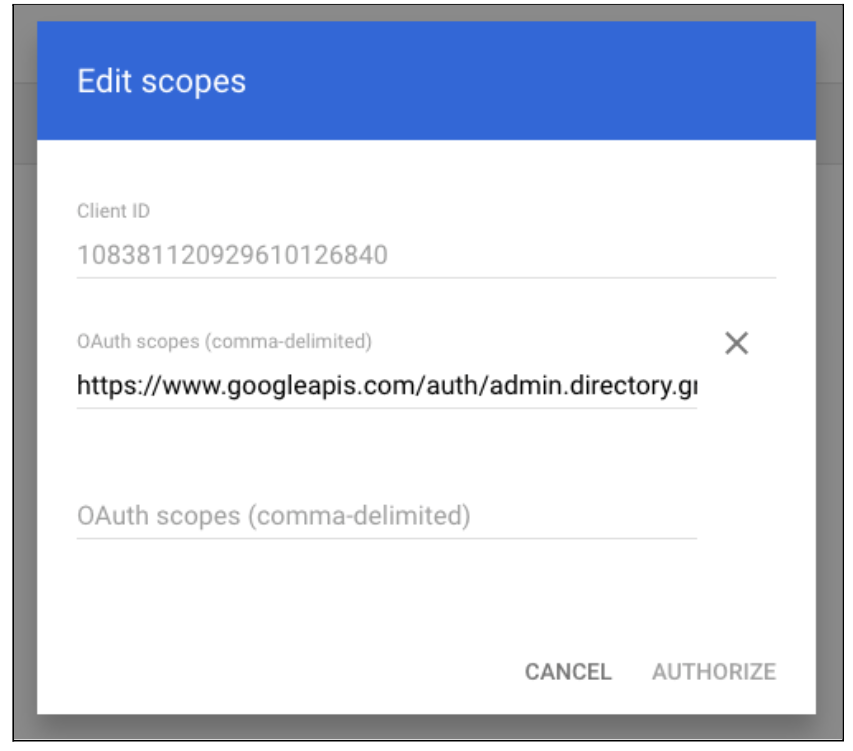

# Table of Contents

1. [Pre-Reqs](#Pre-Requisites)
2. [Terraform Variables](#Terraformtfvars)
3. [Execution](#Execution)
4. [Customize Parameters](#Customize-Parameters)
5. [Post-Deployment](#Post-Deployment)

# Pre-Requisites

**1. Permissions**

Make sure the **GCP User** who runs the script has the following roles at the org level:

- Billing Account User
- Org Admin
- Folder Admin
- Org Policy Admin
- Project Creator
- Compute Shared VPC Admin
- Logging Admin
- Storage Admin

**2. Groups**

Step 1-bootstrap will attempt to create IAM bindings for groups in the GCP organization. These groups MUST exist prior to running step 1. The **`0-prep.sh`** and **`0.5-prep.sh`** scripts should help automate most of these steps.

**Head to the [Execution](#Execution) section if you want to skip explanation of the scripts**

**0-prep.sh**

```bash
# The project ID of the project that will be authorized to make workspace API calls
export ADMIN_PROJECT_ID=foundation-workspace-$RANDOM_ID
## IF YOU CHANGE THIS, YOU MUST ALSO CHANGE IT IN THE DESTROY SCRIPT.
export ADMIN_SA="sa-admin-caller"
#
# Your GCP ORG ID
export ORGANIZATION="CHANGE_ME" # Your GCP ORG ID
## May not need admin email if using DWD with SA
export ADMIN_EMAIL="CHANGE_ME" # The email address of the user deploying the foundation
```

# Terraform.tfvars

In each section (1-7) there is a **terraform.tfvars.example** file that needs to be copied to **terraform.tfvars** and filled-in with all the required information.

- The **`0.5-prep.sh`** script consolidates all the changes needed in the Terraform code into one script. Open this script as well and edit the top section.

**NOTE**: It is recommended to commit the changes after editing the **`0-prep.sh`** & **`0.5-prep.sh`** files and **before** executing the **`auto_deploy.sh`** script below. This allows for easy rollback if needed.

The Domain, BILLING and ORG informations can get gathered on screen for you if you run the **`get-gcp-infos.sh`** script.

**0.5-prep.sh**

```bash
# Update these variables IN THE PREP SCRIPTS per your environment.
#
export ADMIN_EMAIL="CHANGE_ME" # The email address of the user deploying the foundation
export DOMAIN="CHANGE_ME"       # Your User verified Domain for GCP
export BILLING_ACCT="CHANGE_ME" # Your GCP BILLING ID (SADA Sub-Account or Direct ID);
export ORGANIZATION="CHANGE_ME" # Your GCP ORG ID
export REGION=US-WEST1          # Region to deploy the initial subnets
export USE_BUS_CODE="TRUE"      # Set to FALSE to remove the Business Code requirement
export BUS_CODE=zzzz            # The Department code or cost center associated with this Foudnation ; Leave like this if you've set USE_BUS_CODE to FALSE ;
export APP_NAME=app1            # Short name of your workload

```

The specific changes can be found in (the section below)[#customize-parameters]

Additionally, the group names can be altered by editing the names in the `0-prep.sh` script.

# Execution

## Update 0-prep.sh then run it

This will the Workspace project that will provision the required groups by the Foundation.

```bash
nano 0-prep.sh
./0-prep.sh
```

## Enable domain wide delegation

You will need to enable domain wide delegation for the service account created in 0-prep.sh so it can create groups for us.

- Go to : https://admin.google.com/ac/owl and scroll to the bottom and click “MANAGE DOMAIN WIDE DELEGATION”.



- Click “Add new”



- You can find your OAuth client id on the service accounts page of the project created in the previous step. It’s on the far right.



- Paste the client ID in the Client ID field in Google admin. The OAuth scope we need is: https://www.googleapis.com/auth/admin.directory.group



- Click “AUTHORIZE” when you have filled in the client ID and the single auth scope.

- You are now ready to edit and run 0.5-prep.sh

## Update 0.5-prep.sh then run it

This will create an Admin API project, a service account and keys.

```bash
nano 0.5-prep.sh
./0.5-prep.sh
```

## Authenticate to Google

This will set the app credentials required to execute:

```bash
gcloud auth application-default login
```

## Deploy

To start the deployment:

```bash
./auto_deploy.sh
```

The menu will allow for selection of what to deploy. The runtime is around 20 minutes if you select ALL.

## Destroy

To destroy everything that was deployed.

```bash
./destroy.sh
```

To destroy from a specific step

```bash
./destroy.sh [Step Number]
```

# Customize Parameters

## Business Code and App Name

- business_code = A department ID (eg. 90210) - This helps ensure project global uniqueness
- app_name = The name of the app we are creating this structure for. (i.e.: coolgm)

- locals.tf files to change:

  - shared/locals.tf: business_code = "bc-change_me" # BC_CHANGE_ME - Limit to 4-6 caracters
  - 4-dev/locals.tf: app_name = "app-change_me" # APP_CHANGE_ME - Limit to 6 characters
  - 4-dev/locals.tf: business_code = "bc-change_me" # BC_CHANGE_ME - Limit to 4-6 caracters
  - 5-qa/locals.tf: app_name = "app-change_me" # APP_CHANGE_ME - Limit to 6 characters
  - 5-qa/locals.tf: business_code = "bc-change_me" # BC_CHANGE_ME - Limit to 4-6 caracters
  - 6-uat/locals.tf: app_name = "app-change_me" # APP_CHANGE_ME - Limit to 6 characters
  - 6-uat/locals.tf: business_code = "bc-change_me" # BC_CHANGE_ME - Limit to 4-6 caracters
  - 7-prod/locals.tf: app_name = "app-change_me" # APP_CHANGE_ME - Limit to 6 characters
  - 7-prod/locals.tf: business_code = "bc-change_me" # BC_CHANGE_ME - Limit to 4-6 caracters
  - modules/bootstrap_setup/locals.tf: resource_base_name = "bc-change_me" # BC_CHANGE_ME - Limit to 4-6 caracters

## Networking Region

If you need to change the default REGION for the Shared VPC. It's all in the JSON files.

- 3-shared/config/networking/\*.json

  - dev.json: "name" : "sb-p-shared-base-**us-west1**-net1",
  - dev.json: "region": "**US-WEST1**",
  - dev.json: "region": "**US-WEST1**",
  - prod.json: "name" : "sb-p-shared-base-**us-west1**-net1",
  - prod.json: "region": "**US-WEST1**",
  - prod.json: "region": "**US-WEST1**",
  - qa.json: "name" : "sb-p-shared-base-**us-west1**-net1",
  - qa.json: "region": "**US-WEST1**",
  - qa.json: "region": "**US-WEST1**",
  - uat.json: "name" : "sb-p-shared-base-**us-west1**-net1",
  - uat.json: "region": "**US-WEST1**",
  - uat.json: "region": "**US-WEST1**",

# Post-Deployment

## Add code to Cloud Source Repository

```bash
csr/add_to_csr.sh
```

## Billing Export

- From the Billing / Billing export menu
  - For **Standard usage cost**, **Detailed usage cost** and **Pricing**
    - Select the bqds_s_xxxx_billing_data Dataset from the prj-xxxx-s-log-mon project as the target
- With this in place, you can create a Datastudio dashboard to visualize your spend over time.
  - https://cloud.google.com/billing/docs/how-to/visualize-data

## Budgets & Alerts

- From Billing / Budgets & alerts
  - Set a basic Budget for all Projects and Services
    - i.e.: Target amount = $1000
  - Hit Finish

## Logging

- Centralized VPC Flow Logs:
  - From the **prj-xxxx-s-log-mon** project, go to Logging / Logs Storage
    - You can see the VPC Flow Logs Storage bucket there
- Viewing the VPC Flow Logs:
  - From the **prj-xxxx-s-svpc** project, go to Logging / Logs Explorer
    - From the Query Window
      ```bash
      resource.type="gce_subnetwork"
      logName="projects/prj-xxxx-s-svpc/logs/compute.googleapis.com%2Fvpc_flows"
      ```
    - You won't see any logs unless you have flow logs turned on for a subnet and actually have traffic traversing said subnet.

## Monitoring

- From the **prj-xxxx-s-log-mon** project, go to Monitoring / Settings
  - Click **Add GCP Projects**
    - Select all the Foudation Projects
    - In Select Scoping Project, select _Use this project as the scoping project_
      Click Add Projects then click Confirm
- The **prj-xxxx-s-log-mon** projects is now your Monitoring hub for all selected projects. You can now start setting up Dashboards and Alerts.

## Security Command Center

- From Security / Security Command Center menu
  - Enable the Free version of SCC for the Organization
